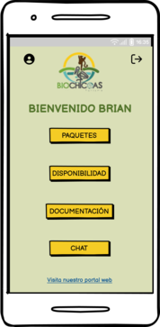

## Biochicoas App  📱

## Biochicoas app is a mobile app worked on the Technologist of Analisis and Software Development at SENA for Asoambiental Company in Colombia.

This software will provide users with the convenience of making travel reservations and payments through a mobile app.
NOTE: The primary language of the app is Spanish.

## Screenshots

Here are some screenshots and mockups of the app prototype:

* App Login View:

* App Register View:
  
* App Home View :
  
* App Availability View:
  
